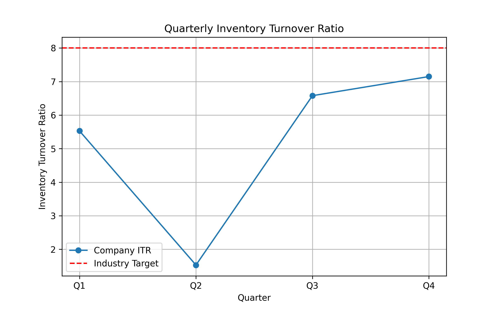

# Inventory Turnover Analysis - 2024

**Email:** 25f1001910@ds.study.iitm.ac.in

## Key Findings
- The average inventory turnover ratio for 2024 is **5.2**, below the industry benchmark of 8.
- Q2 performance is particularly concerning at 1.53, indicating excess inventory.
- The trend shows recovery in Q3 and Q4 but still falls short of the target.

## Business Implications
- Low inventory turnover increases storage costs and reduces cash flow efficiency.
- Misalignment between demand forecasting and inventory levels risks overstocking or stockouts.

## Recommendations
- **Optimize Supply Chain:** Adjust procurement schedules and supplier agreements to match forecasted demand.
- **Improve Demand Forecasting:** Use historical sales data and predictive analytics to plan inventory.
- **Regular Monitoring:** Track ITR quarterly and implement corrective actions promptly.

## Visualization

